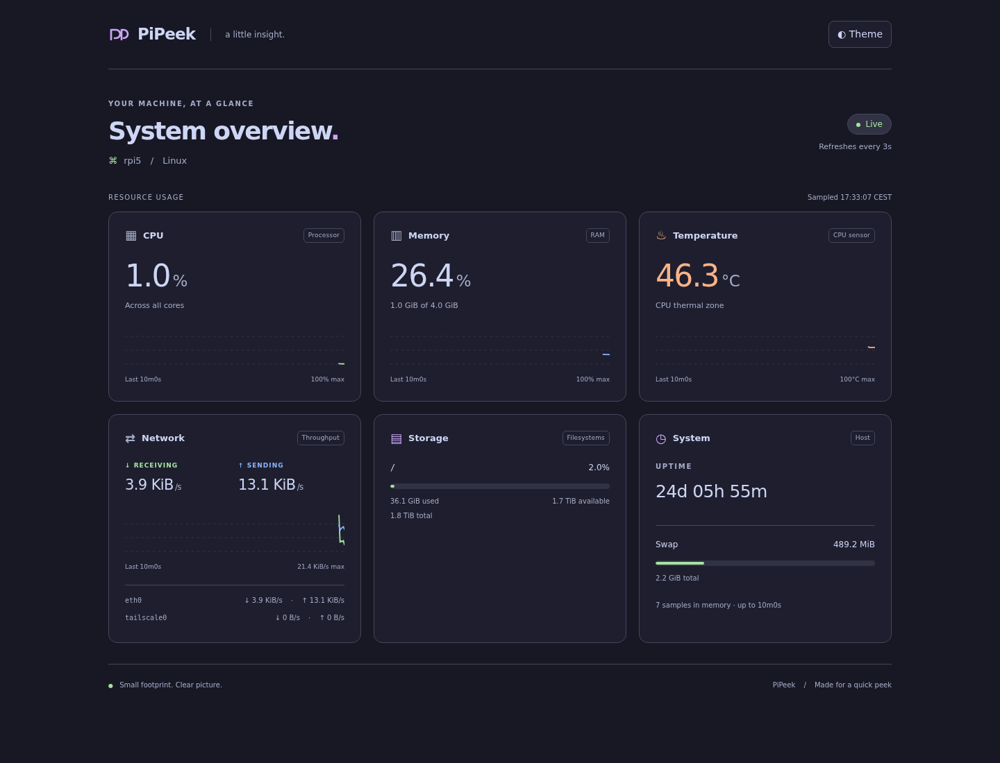

# PiPeek

A small, read-only Linux dashboard for a quick peek at your Raspberry Pi. Go serves HTML; locally bundled HTMX refreshes the metric cards. No database, frontend build, CDN requests, or Go dependencies.



## Run

Requires Linux, Go 1.24 or newer, and Make to build. The resulting binary needs no Go installation, CGO, or companion asset files.

```sh
git clone https://github.com/leue21/pipeek.git
cd pipeek
make build
./bin/pipeek
```

Open <http://127.0.0.1:8080>. To access it directly from another device on your LAN:

```sh
./bin/pipeek -listen :8080
```

Open `http://<pi-address>:8080/`. The default loopback listener is intended for a local nginx reverse proxy. PiPeek has no built-in authentication; use nginx authentication/TLS or a private network for remote access.

## Make targets

```sh
make build                 # Build a static binary at bin/pipeek (also the default)
make test                  # Run Go tests and go vet
make test-race             # Run the race detector on a supported host with CGO
make install SUDO=sudo     # Build and install the binary and systemd unit
make clean                 # Remove local build outputs
```

Installation preserves systemd drop-ins and reloads unit definitions. It does not start or restart the service. Use `sudo systemctl enable --now pipeek` for the first start, or `sudo systemctl restart pipeek` after upgrading. When running as root, omit `SUDO=sudo`.

For packaging or testing without changing the host, use `make install DESTDIR=/tmp/pipeek-package`; this stages the files and skips systemd operations. `GO` and `LDFLAGS` can be overridden, and standard Go cross-compilation environment variables also work with `make build`.

## What it shows

- Aggregate CPU utilization, excluding idle and I/O wait.
- Memory usage based on `MemTotal - MemAvailable`, plus swap.
- CPU temperature when a recognized Linux CPU thermal zone is exposed (including Raspberry Pi `cpu-thermal` and `bcm2835_thermal`). Missing sensors show an em dash.
- Disk usage and available space for configured paths. Defaults to the root filesystem; add required mount points with `-mounts /mnt/data`. The percentage matches `df`'s treatment of reserved blocks: used / (used + available).
- Per-interface receive/send rates and their sum. Loopback is excluded by default. Bridges, virtual interfaces, and their underlying interfaces may count the same traffic; select physical interfaces for host traffic totals.
- Host uptime, ten minutes of CPU/memory/temperature/network history, light and [Catppuccin Mocha](https://catppuccin.com/palette/) dark themes, and a connection status indicator.

Rates need two samples after startup or a counter read failure. Counter resets and new interfaces warm up rather than showing spikes. Core collection failures appear on the page. Network charts scale to the window's peak; CPU and memory use a fixed 0–100% scale. Restarting clears history.

## Configuration

```text
-listen       127.0.0.1:8080   HTTP listener
-base-path    /                URL prefix, such as /pipeek/
-interval     3s               Sampling and browser refresh interval (1s–1m)
-history      10m              Retention, from one interval to 24h; max 3600 intervals
-disks        /                Comma-separated filesystem paths
-mounts       (none)           Required mount points, added to monitored disks
-interfaces   (automatic)      Comma-separated names, e.g. eth0,wlan0
```

PiPeek collects once per interval even with no viewers. A fixed-size ring stores compact history, and the HTML fragment is rendered once per sample and shared by all viewers. The browser polls only while visible and refreshes immediately on return. SVG charts need no charting library. Static assets are cacheable for one day; dynamic pages and fragments use `Cache-Control: no-store`.

For removable drives, use `-mounts /mnt/media_hdd` instead of adding the mount directory to `-disks`. A required mount must appear in `/proc/self/mountinfo`; an existing directory alone is not sufficient. PiPeek also remembers each monitored filesystem ID and reports a change as unavailable until the original filesystem returns. Restart PiPeek to accept an intentional replacement. This identity is kept in memory; `-mounts` detects an absent mount even after restarting, but does not pin a particular device across restarts.

Browser requests time out after ten seconds and retry on the next refresh. Freshness uses server-reported sample age and the browser’s monotonic elapsed time, so browser/Pi clock differences do not cause false stale warnings. Repeated responses containing the same sample do not reset freshness.

The Go server uses HTTP timeouts and gracefully stops on SIGINT/SIGTERM. `GET /healthz` returns 200 for a fresh sample, 503 for stale or degraded core metrics. An absent optional temperature sensor does not mark it degraded. With `-base-path /pipeek/`, the health endpoint is `/pipeek/healthz`.

Use local filesystem paths for predictable sampling latency; an unresponsive network mount can stall filesystem statistics. Run on the host to measure the host: container resource limits are not interpreted.

## nginx

### Dedicated hostname or root URL

Run PiPeek with its defaults and use [deploy/nginx.conf](deploy/nginx.conf). Set `server_name` to a hostname already resolving to your Pi, or access the appropriate nginx virtual host by IP. The example does not configure DNS.

### Under an existing site's `/pipeek/` path

Run:

```sh
./bin/pipeek -listen 127.0.0.1:8080 -base-path /pipeek/
```

Add [deploy/nginx-subpath.conf](deploy/nginx-subpath.conf) inside the existing `server` block. Assets, polling, favicon, and health checks all use the configured prefix. Keep `proxy_pass http://127.0.0.1:8080;` **without a trailing slash**, so nginx preserves that prefix. This follows nginx's [documented proxy_pass URI handling](https://nginx.org/en/docs/http/ngx_http_proxy_module.html#proxy_pass). The app does not infer its prefix from forwarded headers.

For either setup, validate the edited configuration before reloading:

```sh
sudo nginx -t
sudo systemctl reload nginx
```

No WebSocket or streaming configuration is needed. Existing nginx TLS and access controls can apply to the dashboard location.

## systemd

```sh
make install SUDO=sudo
sudo systemctl enable --now pipeek
```

The service uses an unprivileged dynamic user. To use a prefix or custom disks, run `sudo systemctl edit pipeek` and add:

```ini
[Service]
ExecStart=
ExecStart=/usr/local/bin/pipeek -listen 127.0.0.1:8080 -base-path /pipeek/ -mounts /mnt/data
```

Then `sudo systemctl restart pipeek`. Configured paths must be accessible to the service user. The unit creates a private temporary directory, so avoid using `/tmp` as a host filesystem target. View logs with `journalctl -u pipeek`.

## Cross-compile

```sh
# 64-bit Raspberry Pi OS
CGO_ENABLED=0 GOOS=linux GOARCH=arm64 go build -trimpath -ldflags='-s -w' -o bin/pipeek-linux-arm64 .
# 32-bit Raspberry Pi OS, Pi 2 and newer
CGO_ENABLED=0 GOOS=linux GOARCH=arm GOARM=7 go build -trimpath -ldflags='-s -w' -o bin/pipeek-linux-armv7 .
# Original Pi / Pi Zero with ARMv6
CGO_ENABLED=0 GOOS=linux GOARCH=arm GOARM=6 go build -trimpath -ldflags='-s -w' -o bin/pipeek-linux-armv6 .
```

## Validate and measure

```sh
make test
make test-race
go test -run '^$' -bench . -benchmem
```

An optional browser regression check is available at `scripts/browser-check.cjs`. With Playwright installed outside the project, run `NODE_PATH=/path/to/node_modules node scripts/browser-check.cjs http://127.0.0.1:8080/` against a running instance. Browser tooling is not a runtime dependency.

Tests cover required mount disappearance/recovery, filesystem replacement, graceful shutdown and deadlines, sample freshness, counter deltas/resets, missing metrics, memory accounting, interface selection, bounded history, concurrent readers, escaping, and reverse-proxy routes at root and nested prefixes. Measure resident memory and CPU on your target Pi; the Go runtime, kernel, configured mounts, interfaces, and clients affect the footprint. Benchmarks are not a hardware-independent resource guarantee.

HTMX 2.0.10 is pinned and embedded under `web/vendor`, following its [local installation documentation](https://htmx.org/docs/). Its license is included in [web/vendor/HTMX-LICENSE](web/vendor/HTMX-LICENSE).

## License

PiPeek is licensed under the [MIT License](LICENSE). Bundled HTMX retains its [Zero-Clause BSD license](web/vendor/HTMX-LICENSE).
